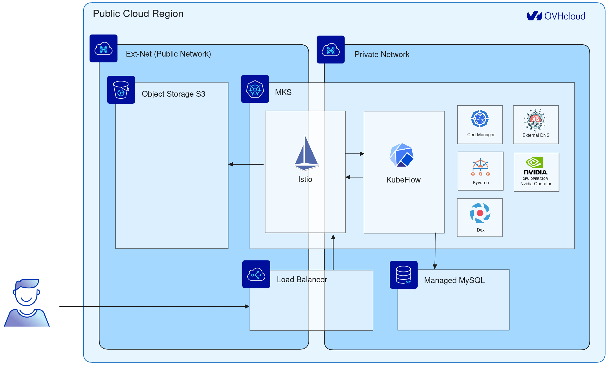

# Kubeflow on OVHcloud Public Cloud

This Terraform will create and configure:

* A private network
* A managed Kubernetes cluster
* A load balancer for Kubernetes with a public IP
* A MySQL managed database
* An object storage bucket
* A Kubeflow deployment
* A Nvidia GPU Operator to install automatically Nvidia drivers on GPU nodes
* A Kyverno deployment to secure the workload created by the Kubeflow users
* A FQDN for Kubeflow
* Let's Encrypt TLS certificates for Kubeflow



**Requirements:**

You need the following:
* [Terraform](https://www.terraform.io/) installed
* An [OVHcloud Public Cloud project](https://www.ovhcloud.com/en/public-cloud/)
* An [OVHcloud vRack private network](https://www.ovhcloud.com/en/network/vrack/)
* An [OVHcloud domain name](https://www.ovhcloud.com/en/domains/)

As we are going to configure the infrastructure using a private network, your public cloud project needs to be in a vRack.

## Configure the deployment

### Configure the OVHcloud Terraform provider

Create an OVHcloud API token:

https://api.ovh.com/createToken?GET=/\*&POST=/\*&PUT=/\*&DELETE=/\*

Configure Terraform with this token:

```bash
vim ovhrc.sh
```

```bash
export OVH_ENDPOINT="ovh-eu"
export OVH_BASEURL="https://eu.api.ovh.com/1.0/"
export OVH_APPLICATION_KEY="<your_application_key>"
export OVH_APPLICATION_SECRET="<your_application_secret>"
export OVH_CONSUMER_KEY="<your_consumer_key>"
export OVH_CLOUD_PROJECT_SERVICE="$OS_TENANT_ID"

export TF_VAR_ovh_api_dns_application_key="<your_application_key>"
export TF_VAR_ovh_api_dns_application_secret="<your_application_secret>"
export TF_VAR_ovh_api_dns_consumer_key="<your_consumer_key>"
```

You can create a second token for the DNS configuration with limited permissions:
https://github.com/kubernetes-sigs/external-dns/blob/master/docs/tutorials/ovh.md#creating-ovh-credentials

## Customize the deployment

Configure Terraform with the public cloud project ID:

```bash
vim terraform.tfvars
```

```bash
ovh_os_project_id = <your_openstack_project_id>
```

Configure Terraform with your OVH domain name:

```bash
vim terraform.tfvars
```

```bash
ovh_dns_domain = "<your_ovh_domain_name>"
```

You can find the list of configuration variables in `variables.tf` and you can override the default values in `terraform.tfvars`.

## Deploy the stack

```bash
source ovhrc.sh
terraform init
terraform plan
terraform apply
```

## Get the Kubeflow default user password

```bash
terraform output kubeflow_password
```

## Troubleshoot

### Access the Kubernetes cluster

```bash
terraform output --raw ovh_kube_cluster_kubeconfig > ./kubeconfig
export KUBECONFIG=./kubeconfig
kubectl get nodes
```